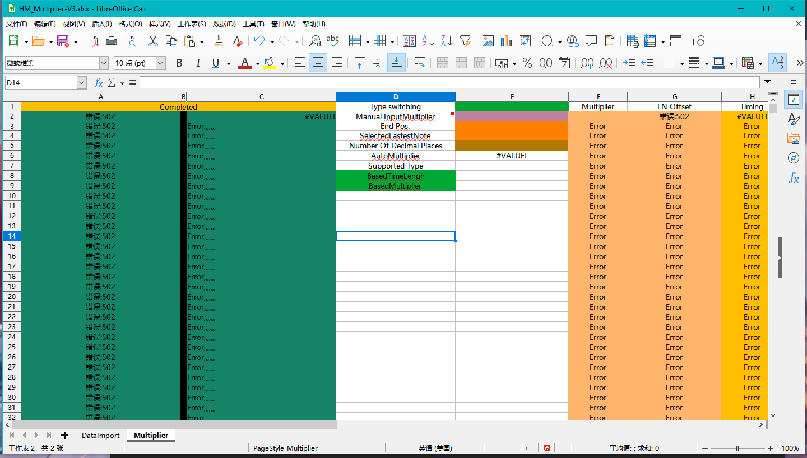

## 倍速工具

---

导入完数据后 转至Multiplier工作表 在填写完信息后 蓝绿色列的即为完成转换的正常Note或Object 分别置于铺面文件的.osu内[TimingPoints] [HitObjects]下即可

这个工具一共有两种倍速模式以及格式支持 前者支持手动输入倍速以及依靠两个Note间倍速计算 后者支持对Timing以及Object的倍速格式

TypeSwitching即为模式切换 也就是两种倍速模式

- BasedTimeLength

这个模式依靠对时间长度的计算 也就是Note间的倍速计算 此模式仅需得到原本导入完的数据 以及要倍速到的Note和已被选中的最后一个Note的数据 即可完成自动倍速计算

需要填写End Pos.以及SelectedLastestNote 目标倍速结束位置和选中Note的最后的一个 如果最后一个Note为LongNote可能需要在LongNote结束位置放置一个Note再复制 避免出错

- BasedMultiplier

依靠手动输入倍速的变速模式 仅需填写Manual InputMultiplier 即可完成计算

待数据计算完成后 蓝绿色列即为结果

当前并不是最简化的 等待后期更改